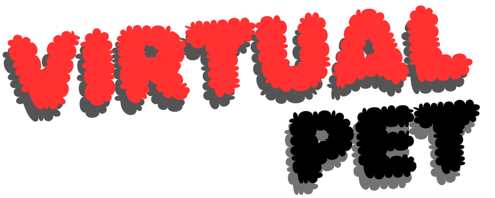

<p align="right"> 
  
 </p> 
 
<p align="center"> 

</p>

<p align="center"> 
  
  
  
  
  
  
  
  
  
  
  
  
  
  
  
  
  
  
  
</p>

## 📜 Description

<table style="border: none;">
  <tr>
    <td style="padding-right: 20px;">
      
    </td>
    <td>     
VirtualPet is an all-in-one app that integrates features like AI-powered interactive offline chat, image generation, OCR capabilities, an AI-powered code editor, a built-in web browser, a mini video player, shortcut management, and access to public anime content for local viewing and much more, all within a seamless user interface.
    </td>
    <td style="padding-right: 20px;">
      
    </td>
  </tr>
</table>


## 🚀 Demo

https://github.com/user-attachments/assets/4e158f76-3b60-4190-ae40-4b4fc79eee32


## ✨ Features

<table>
  <tr>
    <td>
      
      <details open>
        <summary>✨ AI Pre-trained Model Chat</summary>
        
> A conversational AI model that can respond to a variety of user queries and engage in interactive conversations. 
> Currently, the default model is "gpt4all-falcon-newbpe-q4_0", and it is not possible to switch models dynamically at this time. (Using **LLamaSharp**)
        
  <details>
    <summary>🎥 Demo</summary>
    <p align="center"> 
      
    </p>
  </details>
</details>
    </td>
  </tr>
</table>

<table>
  <tr>
    <td>
      
<details open>
  <summary>✨ Image Generation in Chat</summary>
  
    
  > Generate images directly within the chat interface based on user prompts or descriptions. This feature uses **Prodia IA** to transform text into visuals, creating unique and personalized images instantly.

  <details>
    <summary>🎥 Demo</summary>
    
  <p align="center"> 
  
  </p>
    
  </details>
</details>
    </td>
  </tr>
</table>


<table>
  <tr>
    <td>
      
      <details open>
  <summary>✨ Wikipedia Queries in Chat</summary>
  
    
  > Query Wikipedia in real-time from within the chat interface, providing quick access to accurate information on a wide range of topics directly in the app.

  <details>
    <summary>🎥 Demo</summary>
    
  <p align="center"> 
  
  </p>
    
  </details>
</details>
    </td>
  </tr>
</table>


<table>
  <tr>
    <td>
      
<details open>
  <summary>✨ Object Viewer (.obj)</summary>
  
    
  > View and interact with 3D .obj object files directly in the app using local files or with results from the **sketchfab.com** website. This feature is designed to help users visualize with 3D models effortlessly.
  <details>
    <summary>🎥 Demo</summary>
    
  <p align="center"> 
  
  </p>
    
  </details>
</details>
    </td>
  </tr>
</table>

<table>
  <tr>
    <td>
      
<details open>
  <summary>✨ Anime Content Viewer from Two Sources with Spanish/English Language Support</summary>
  
    
  > Watch anime content from two different sources (**allanime.to** and **www3.animeflv.net**), with both Spanish and English subtitle support, providing a broader selection of anime for users from various language backgrounds.
  <details>
    <summary>🎥 Demo</summary>
    
  <p align="center"> 
  
  </p>
    
  </details>
</details>
    </td>
  </tr>
</table>


<table>
  <tr>
    <td>
      
<details open>
  <summary>✨ Run AI-generated Code in the Integrated Editor</summary>
  
    
  > Execute code generated by the AI directly within the integrated code editor, allowing for seamless integration between development and AI-driven suggestions.
  <details>
    <summary>🎥 Demo</summary>
    
  <p align="center"> 
  
  </p>
    
  </details>
</details>
    </td>
  </tr>
</table>

<table>
  <tr>
    <td>
      
<details open>
  <summary>✨ Integrated Code Editor Supporting C#, Python, Java Projects or Solutions</summary>
  
    
  > A powerful code editor designed to support multiple programming languages including C#, Python, and Java, enabling users to work on a variety of projects and solutions in a unified environment.
  <details>
    <summary>🎥 Demo</summary>
    
  <p align="center"> 
  
  </p>
    
  </details>
</details>
    </td>
  </tr>
</table>

<table>
  <tr>
    <td>
      
<details open>
  <summary>✨ Autocompletion / IntelliSense in the Editor</summary>
  
    
  > The integrated editor features autocompletion and IntelliSense support to boost development speed and accuracy by providing code suggestions and real-time syntax help.
  <details>
    <summary>🎥 Demo</summary>
    
  <p align="center"> 
  
  </p>
    
  </details>
</details>
    </td>
  </tr>
</table>

<table>
  <tr>
    <td>
      
<details open>
  <summary>✨ Custom Web Page Bookmarking</summary>
  
    
  > Save and organize your favorite websites for quick access within the app, making it easy to navigate to commonly used resources directly from the interface.
  <details>
    <summary>🎥 Demo</summary>
    
  <p align="center"> 
  
  </p>
    
  </details>
</details>
    </td>
  </tr>
</table>

<table>
  <tr>
    <td>
      
<details open>
  <summary>✨ Mini Video Player</summary>
  
    
  > A compact and lightweight video player embedded within the app, allowing users to watch video content without needing to leave the interface.
  <details>
    <summary>🎥 Demo</summary>
    
  <p align="center"> 
  
  </p>
    
  </details>
</details>
    </td>
  </tr>
</table>

<table>
  <tr>
    <td>
      
<details open>
  <summary>✨ Online Multimedia Content Viewer</summary>
  
    
  > View and stream various forms of multimedia content, including videos, images, and audio, directly from online sources within the app.
  <details>
    <summary>🎥 Demo</summary>
    
  <p align="center"> 
  
  </p>
    
  </details>
</details>
    </td>
  </tr>
</table>

<table>
  <tr>
    <td>
      
<details open>
  <summary>✨ Web Edge Integration with Desktop Tab Sync</summary>
  
  > A fully integrated Web Edge panel within the app, synchronized with the desktop version of Microsoft Edge. This feature allows you to access and sync browser tabs across devices seamlessly, making it easy to continue browsing from where you left off directly in the app.
  
  <details>
    <summary>🎥 Demo</summary>
    
  <p align="center"> 
  
  </p>
    
  </details>
</details>
    </td>
  </tr>
</table>


<table>
  <tr>
    <td>
      
<details open>
  <summary>✨ Integrated OCR Tool</summary>
  
    
  > An Optical Character Recognition (OCR) tool integrated within the app to extract text from images or scanned documents, helping to digitize written content effortlessly.
  <details>
    <summary>🎥 Demo</summary>
    
  <p align="center"> 
  
  </p>
    
  </details>
</details>
    </td>
  </tr>
</table>

<table>
  <tr>
    <td>
      
<details open>
  <summary>✨ News Panel</summary>
  
    
  > Stay up-to-date with the latest news and headlines directly through the integrated news panel, ensuring you're always informed of current events.
  <details>
    <summary>🎥 Demo</summary>
    
  <p align="center"> 
  
  </p>
    
  </details>
</details>
    </td>
  </tr>
</table>

<table>
  <tr>
    <td>
      
<details open>
  <summary>✨ Integrated Command Line (CMD) Execution in Chat</summary>
  
    
  > Execute command-line instructions directly from the chat interface, providing a streamlined way to run various tasks and commands without leaving the app.
  <details>
    <summary>🎥 Demo</summary>
    
  <p align="center"> 
  
  </p>
    
  </details>
</details>
    </td>
  </tr>
</table>

<table>
  <tr>
    <td>
      
<details open>
  <summary>✨ File Sharing Server with WebSocket Support for Devices on the Same Network</summary>
  
    
  > A server feature that allows file sharing between devices on the same network, coupled with Bluetooth notifications to alert users to the URLs for file access.
  <details>
    <summary>🎥 Demo</summary>
    
  <p align="center"> 
  
  </p>
    
  </details>  
</details>
    </td>
  </tr>
</table>


<table>
  <tr>
    <td>
      
<details open>
  <summary>✨ Screen Casting Server to Stream Device Display Live</summary>
  
    
  > Stream your device’s screen live to the app, enabling real-time viewing and sharing of what's happening on your device's display using VirtualPetApp.
  <details>
    <summary>🎥 Demo</summary>
    
  <p align="center"> 
  
  </p>
    
  </details>  
</details>
    </td>
  </tr>
</table>

<table>
  <tr>
    <td>
      
<details open>
  <summary>✨ Android App to Share Mobile Screen to VirtualPet</summary>
  
    
  > An Android app that allows users to share their mobile screen with VirtualPet in real-time, enabling seamless interaction and display mirroring.
  <details>
    <summary>🎥 Demo</summary>
    
  <p align="center"> 
  
  </p>
    
  </details>
</details>
    </td>
  </tr>
</table>


<table>
  <tr>
    <td>
      
<details open>
  <summary>✨ Send Files via Bluetooth to Multiple Devices Simultaneously</summary>
  
    
  > Send files to multiple devices at the same time using Bluetooth, allowing you to share files quickly and efficiently between different devices on the same network.
  <details>
    <summary>🎥 Demo</summary>
    
  <p align="center"> 
  
  </p>
    
  </details>
</details>
    </td>
  </tr>
</table>

<table>
  <tr>
    <td>
      
      <details open>
        <summary>✨ AI Response Cancellation</summary>
        
> This feature allows users to stop the AI ​​response midway by pressing a button. Once activated, the AI ​​immediately stops any further output, giving users the control to move on to the next query or action. 
  <details>
    <summary>🎥 Demo</summary>
    <p align="center"> 
      
    </p>
  </details>
</details>
    </td>
  </tr>
</table>

<br>

> [!Important]
> The following features are in progress and will be introduced in future updates.
<table>
  <tr>
    <td>
      
<details open>
  <summary>⏰ Dark/Light Mode</summary>
  
    
  > Toggle between Dark and Light modes based on your environment or preference. Dark mode helps reduce eye strain in low-light conditions, while Light mode offers a more vibrant and energy-efficient experience in bright environments.
  
</details>
    </td>
  </tr>
</table>

<table>
  <tr>
    <td>
      
<details open>
  <summary>⏰ Multi-language Support</summary>
  
    
  > The app will support multiple languages, allowing users to choose their preferred language for a more personalized and comfortable experience. This feature will make the app accessible to a global audience.
  
</details>
    </td>
  </tr>
</table>

<table>
  <tr>
    <td>
      
<details open>
  <summary>⏰ Hot-swappable AI Models from the Configuration Panel</summary>
  
    
  > This feature will allow users to dynamically switch between different pre-trained AI models directly from the configuration panel. Users will be able to select the model best suited to their tasks without restarting the application or disrupting their workflow.
  
</details>
    </td>
  </tr>
</table>

<table>
  <tr>
    <td>
      
<details open>
  <summary>⏰ Voice Command Integration</summary>
  
    
  > Integrate voice commands to control the app’s features, enabling hands-free operation and enhancing accessibility for users who prefer voice interaction over manual input.
  
</details>
    </td>
  </tr>
</table>


## 📦 Requirements

To run VirtualPet with its full range of features, including the AI model and other functionalities, the following hardware and software specifications are recommended:

### 🖥️ Hardware Requirements

- **RAM**: 16 GB or more (for optimal performance)
- **CPU**: Intel Core i5 or equivalent (minimum), with at least 4 cores and 8 threads. A higher-end processor such as an Intel Core i7 or i9, or an AMD Ryzen 7 or 9, is recommended for better performance, especially when running the AI model.
- **GPU**: A dedicated GPU with at least 8 GB of VRAM (e.g., NVIDIA GTX 1080, RTX 2060, or better). A GPU is required to run the AI model efficiently, particularly for tasks such as image generation and real-time AI processing.
- **Storage**: SSD with at least 20 GB of free space for optimal loading and storage of models and assets.
- **Network**: While the AI model runs locally, an internet connection may be required for some external features, such as browsing or accessing public anime content websites.

### 🖥️ Software Requirements

- **Operating System**: Windows 11 (with support for GPU acceleration).
- **.NET Framework**: .NET 8 or later (for full compatibility with the integrated features and the AI model).
- **CUDA** (for NVIDIA GPUs): Ensure that the latest CUDA version compatible with your GPU is installed for optimal performance with AI models.
- **Driver**: Latest GPU drivers installed (required for AI acceleration).
  
> [!TIP]
> For best performance, especially when using AI models, it is highly recommended to have a multi-core processor and a high-end GPU to handle complex calculations in real-time.
> A stable internet connection may be required for some features like anime content viewing and web browsing, but the AI model and most core functionalities are fully operational offline once set up.


## 📀 Installation

#### 👉Coming Soon...

## ⚙️ Configuration

VirtualPet relies on external services to provide some of its features, and to use them, you'll need to obtain API keys. The external services used by VirtualPet are as follows:

- **Prodia IA**: This AI service provides various functionalities within the app.
- **NewsAPI**: This API allows the app to fetch and display the latest news headlines.

### How to Add Your API Keys

Once you have obtained the necessary API keys for these services, you can add them to VirtualPet using one of the following methods:

#### A. Manual Configuration via `apiKeys.json`

1. Locate the `apiKeys.json` file in the `VirtualPet/Credentials/` directory. This file is where you will store your API keys.
2. Open the `apiKeys.json` file and enter your API keys in the following format:

```json
{
  "ApiKeys": [
    { "NEWSAPI": "YOUR_API_KEY" },
    { "PRODIA": "YOUR_API_KEY" }
  ]
}
```
#### B. Setting API Keys Through the Configuration Panel

Alternatively, when running VirtualPet, you can set your API keys directly from the **Configuration Panel** within the application:

1. Launch VirtualPet.
2. Open the **Configuration Panel** from the app's settings menu.
3. Enter your API keys for both Prodia IA and NewsAPI in the respective fields.
4. Save your changes.

This method allows you to update the API keys without needing to manually edit configuration files.


## 🤕 Known Issues

- In some screen resolutions, the panel does not adapt correctly, causing overflow of the tabs and their respective icons. This behavior results in incorrect display of the interface, negatively impacting the user experience, especially on screens with non-standard dimensions or smaller resolutions. (🐞)

## ⌨️ Setup

<table>
  <tr>
    <td>
<details open>
  <summary>💻 VirutalPet</summary>
  
### Prerequisites

Before starting with the **VirtualPet** setup, ensure you meet the following preconditions:

1. **Bluetooth Enabled**: Enable Bluetooth on your device.
2. **Internet Connection**: An internet connection is required the first time you run the program to download the necessary components.
3. **Windows Transparency Mode**: This mode must be enabled. To configure it:
   - Go to `Settings` > `Accessibility` > `Visual Effects`.
   - Enable the **Transparency Effects** option.

---

### Project Setup

1. **Obtain the API Keys**:
   - Retrieve the API keys mentioned in the **Configuration** section.
2. **Clone the Repository**:
   - Run the following command:
     ```bash
     git clone <repository-URL>
     ```
3. **Configure the API Keys**:
   - Set the API keys using the options provided in the project documentation.
4. **Open and Run the Project**:
   - Open Visual Studio as **Administrator**.
   - Run the **VirtualPet.Main** project with the `Debug - x64` profile.

> **Note:** The first time you run the project:
> - If the required model is not installed, a form will appear for installation.
> - For subsequent runs, if the model is already installed, the initial loading time will be shorter.

---

### Solution Structure

The solution consists of two main projects:

1. **VirtualPet.Main**:
   - Responsible for managing the forms and user interface-related classes.
2. **VirtualPet.Lib**:
   - Contains abstract classes reusable across the forms.

---
### `PathArchitecture` Class

The `PathArchitecture` class is responsible for managing all paths within the project, differentiating between:

- Operating systems: `x64` and `x86`.
- Execution modes: `Release` or `Debug`.

> **Important:** All project paths must be defined in this class. Avoid hardcoding paths directly in the code.

---
</details>
    </td>
  </tr>
</table>


<table>
  <tr>
    <td>
<details open>
  <summary>📱 VirutalPet App</summary>

### Description

The **VirtualPet** app allows you to stream content from an Android device to **VirtualPet** (the purpose and functionality
of the app may change in the future)

---

### Setup

To configure the application, edit the `MainActivity` file with the following steps:

1. Locate and modify the line where the WebSocket server URI is set (Replace this IP address with the device running VirtualPet):
   
   ```kotlin
   val serverUri = URI("ws://IP:5700")
   ```
   
---
</details>
    </td>
  </tr>
</table>

## 👨‍💻 Contributing

> [!NOTE]
> Feel free to open an issue or submit a pull request if you have suggestions or improvements!
> This project uses **GitHub Issues** for tracking bugs and feature requests.
All contributions are welcome! There's a TODO list in [VirtualPet Dev Project](https://github.com/users/AcoranGonzalezMoray/projects/4) and you can pick an interesting one to start. Please read the [contributing guide](./CONTRIBUTING.md) for more information. 

You can also do one of the following to help me make VirtualPet better
- Submit a feature request.
- Star and share VirtualPet to let others know about it.
- Just open an issue about the problem you've found!
  
## ⚠️ Disclaimer
> [!Warning]
> This software includes features that allow users to extract data from websites. Currently, some of the extraction features are provided for demonstration purposes to showcase the software's capabilities. It is the user's responsibility to ensure that their use of this software complies with all applicable laws and the terms of service of the websites they > interact with.
> The developer does not endorse or promote unauthorized use of this software to access or extract content from any third-party websites or other platforms. By using this software, you agree that the developer is not responsible for any legal issues or consequences resulting from your use of the software.

## 📄 License
> [!CAUTION]
> If you redistribute or modify this software, you must acknowledge the original code in your work and provide a copy of the AGPL-3.0 license along with the source code.
> If you make changes, make sure to indicate the modifications made, so that users can distinguish between the original code and your modifications. Thank You 😁


## 🛠️ External Tools
<details>
  <summary>  VirtualPet leverages various external tools and libraries to enhance its functionality. These tools help optimize performance, extend the range of features, and provide a better user experience.</summary>
  
### ⚙️ AI Model (Local)
- **[LLamaSharp](https://github.com/SciSharp/LLamaSharp)**: A powerful library for interacting with AI models locally. It allows for fast processing of AI-powered tasks without requiring an internet connection.
- **[Whisper.net](https://github.com/whispernet/whisper.net)**: A speech-to-text API that processes audio into text using a local or cloud-based model, providing high accuracy for transcription tasks.

### ⚙️ Web Browser and Automation
- **[Selenium WebDriver](https://www.selenium.dev/)**: A web automation tool for interacting with web pages, used in VirtualPet for automating browser tasks. 
- **[WebDriverManager](https://github.com/bonigarcia/webdrivermanager)**: A library that automatically manages browser drivers for Selenium WebDriver, ensuring compatibility and simplifying setup.
- **[RestSharp](https://restsharp.dev/)**: A REST API client for interacting with HTTP-based services, used for making API calls and fetching data from web services.
- **[WebSocketSharp](https://github.com/sta/websocket-sharp)**: A library for managing WebSocket connections, allowing real-time communication between VirtualPet and external services.

### ⚙️ Image Generation
- **[Stable Diffusion](https://stability.ai/)**: A deep learning model used for generating high-quality images from text prompts. It is integrated into VirtualPet to enable image generation within the chat feature.
- **[Prodia](https://prodia.com/)**: Easy-to-use Stable Diffusion API for AI-powered image generation at 90% lower cost than AWS. Effortless scale with no infrastructure worries.

### ⚙️ OCR (Optical Character Recognition)
- **[Tesseract OCR](https://github.com/tesseract-ocr/tesseract)**: An open-source OCR engine used for extracting text from images, making it easy to digitize printed or handwritten content.

### ⚙️ Web Browser
- **[CEF (Chromium Embedded Framework)](https://bitbucket.org/chromiumembedded/cef)**: A framework used to embed Chromium-based browsers into applications, providing access to web browsing functionality directly within the app.

### ⚙️ Code Analysis and Editing
- **[Microsoft.CodeAnalysis](https://github.com/dotnet/roslyn)**: A set of APIs used for analyzing, compiling, and scripting C# code within the VirtualPet environment. Includes several components for C# scripting and workspace management.
### ⚙️ Audio
- **[NAudio](https://github.com/naudio/NAudio)**: A .NET audio library used to record, manipulate, and play audio in VirtualPet, supporting various audio formats and features like real-time audio processing.

### ⚙️ UI and Graphics
- **[HelixToolkit](https://github.com/helix-toolkit/helix-toolkit)**: A 3D graphics library for creating high-quality 3D models and visualizations, integrated into VirtualPet for rendering interactive 3D scenes.
- **[FontAwesome.Sharp](https://github.com/FortAwesome/Font-Awesome)**: A library that allows the use of Font Awesome icons in Windows Forms and WPF applications, providing intuitive and stylish icons for the UI.
- **[FCTB](https://github.com/markloughran/FCTB)**: A fast, customizable text box control for displaying and editing text with syntax highlighting in C# and other languages.

These external tools are essential for providing rich features in VirtualPet. They enhance the application's performance and capabilities, making it a powerful and versatile tool for users.

</details>


